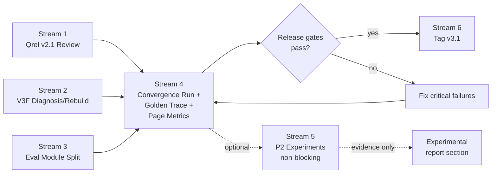

# RAG v3.1 Closure Design

Date: 2026-04-26

## Goal

> v3.1 is a qrel-governed, traceable, reproducible retrieval-evaluation baseline. It is not the release for online fallback, GraphRAG, or broad backend package restructuring.

Close out RAG v3.1 as a defensible milestone: fix known data/index issues, make evaluation metrics trustworthy, complete module governance, run diagnostic experiments, and tag the release.

## Release Classification

| Category | Streams | Blocks tag |
|---|---|---|
| Release-critical | 1, 2, 3, 4, 6 | Yes |
| Experimental | 5 | No |
| Deferred | Online fallback activation, GraphRAG, HyDE, backend package restructuring | v3.2+ |

## Approach

Parallel streams with convergence. Streams 1/2/3 run concurrently (no shared state). Stream 4 converges results for a full re-run. Stream 5 runs P2 experiments as non-blocking experimental work. Stream 6 tags the release.



---

## Stream 1: LLM Qrel Review

### Objective

Produce `qrel_v2.1` with chunk/root coverage >= 0.85 and auditable provenance. `qrel_v2` remains immutable as the pre-review baseline.

### Three-phase layered process

**Phase 1 — Machine pre-check.** For each of 125 rows, verify:
- chunk/root ID existence in chunk pool
- text hash match against canonical pool
- page distance consistency
- Output: rows tagged `pre_check_pass` / `pre_check_fail` with reasons.

**Phase 2 — LLM judgment (layered scope).**

| Layer | Rows | Action | Affects qrel_v2.1 |
|---|---|---|---|
| failed | 26 | LLM remap candidates from chunk pool + human confirmation | Yes |
| ambiguous | 12 | LLM rank candidates + human confirmation | Yes |
| aligned spot-check | 20-30 | LLM review for consistency estimate | Only for agreement rate |
| aligned full | 87 | LLM generates suggestion, does not directly modify | Default no change |

LLM input per row: `question`, `expected_answer`, `source_excerpt`, candidate chunk texts from `supporting_chunks` (or re-searched from pool for failed rows).

LLM judgment prompt: "Does this chunk provide sufficient evidence to support the core claims in expected_answer?"

Output per row:

```json
{
  "qid": "...",
  "llm_verdict": "accept | reject | remap",
  "llm_confidence": 0.0,
  "llm_reasoning": "one sentence",
  "support_level": "full_support | partial_support | topical_only | no_support",
  "claim_coverage": 0.0,
  "new_chunk_id": null,
  "new_root_id": null
}
```

Accept only when `support_level == full_support` and `claim_coverage >= 0.80`.

**Phase 3 — Human review queue with agreement gating.**

Sort by `llm_confidence` ascending. Mark:
- `llm_approved`: LLM high-confidence accept (>= 0.85), pending spot-check.
- `needs_human_review`: LLM low-confidence, all remap, all reject.
- Human reviews all `needs_human_review` rows.
- Spot-check: randomly sample 20 from `llm_approved`.

Agreement gating:

| LLM-human agreement | Policy |
|---|---|
| >= 90% | High-confidence `llm_approved` rows may batch-promote to `approved` |
| 70%-90% | LLM suggestions are advisory only; all status changes require human confirmation |
| < 70% | Stop using LLM verdict; fall back to machine pre-check + human-only review |

### Review status state machine

```
draft → llm_approved → approved (after spot-check batch passes agreement gate)
draft → needs_human_review → approved | corrected | rejected
draft → llm_remapped → needs_human_review → corrected | rejected
```

### Provenance

Every row records:
- `review_source`: `llm` | `human` | `llm_then_human`
- `reviewer_notes`: free text
- `qrel_version`: `v2.1`

### Artifacts

| File | Purpose |
|---|---|
| `scripts/review_rag_qrels.py` | Review script |
| `.jbeval/datasets/rag_chunk_gold_v2.jsonl` | Immutable pre-review baseline |
| `.jbeval/datasets/rag_chunk_gold_v2.1.jsonl` | Reviewed version |
| `.jbeval/qrel_reviews/v2_to_v2.1_diff.json` | Diff explaining changes |
| `.jbeval/qrel_reviews/llm_review_suggestions.jsonl` | Full LLM output |
| `.jbeval/qrel_reviews/human_review_queue.md` | Priority queue for human review |

### Qrel review report metrics

| Metric | Purpose |
|---|---|
| full_support rate | True strong-evidence ratio |
| partial_support rate | Weak qrel risk |
| remap success rate | Ability to rescue failed rows |
| human disagreement rate | LLM reliability |
| rejected after LLM accept | High-risk signal |

### Acceptance

- `qrel_v2` immutable, `qrel_v2.1` created with `qrel_version` field.
- >= 107/125 rows with status `approved` or `corrected`.
- Chunk/root qrel coverage >= 0.85.
- Ambiguous + failed total <= 18.
- Spot-check: 20 `llm_approved` rows sampled, human agreement >= 90% (or policy degrades per gating table).

---

## Stream 2: V3F Rebuild

### Objective

Fix V3F collapse (file_recall_miss=70, File@5=0.416, P50=34ms), or formally exclude V3F from v3.1 baseline if unfixable.

### Two-phase process with exit path

**Phase 1 — Index health diagnosis.** New script `scripts/diagnose_variant_profile.py`:

```
uv run python scripts/diagnose_variant_profile.py --variant V3F --compare-to GS3
```

Checks:
- Collection exists in Milvus
- Document count matches canonical corpus (60 files)
- Chunk count within expected range (80%-120% of GS3's tcf collection)
- Unique filename count matches
- BM25 state path exists and matches collection + text_mode
- Parent chunk namespace exists
- Qrel expected filenames coverage >= 0.95
- Sample: first 10 qrel expected files have at least one candidate before rerank

**Phase 2 — Conditional rebuild + smoke test.**

| Diagnosis result | Action |
|---|---|
| Collection/profile/BM25 mismatch | Rebuild V3F index |
| Diagnosis clean but retrieval fails | Inspect retrieval path / variant config |
| Rebuild succeeds and passes gates | Include V3F in Stream 4 baseline claims |
| Rebuild fails or cannot meet quality+speed gates | Mark V3F experimental, exclude from v3.1 baseline |

Rebuild: `uv run python scripts/reindex_knowledge_base.py --profile v3_fast`
Smoke: run V3F single-variant evaluation on 125 gold rows.

### Acceptance

Index health:
- Collection document count == 60
- Chunk count > 0 and within 80%-120% of GS3's tcf collection
- BM25 state path valid

Retrieval quality (hard pass):
- FileCandRecall >= 0.95
- File@5 >= 0.85
- Error rate = 0
- P50 < GS3 P50 * 0.75 (V3F must be faster; if not, its value proposition is gone)

Soft fallback: if V3F cannot pass after diagnosis + rebuild, document root cause and exclude from release baseline. This does not block v3.1.

---

## Stream 3: Evaluation Module Split

### Objective

Reduce `evaluate_rag_matrix.py` (2723 lines) by extracting preflight, per-sample metrics, reporting, and variant config into focused modules. Behavior must not change.

### Hard constraints

- No backend package restructuring.
- No algorithm changes.
- No metric definition changes except moving code.
- Every extraction step must pass saved-row regression.

### Extraction plan

| New module | Source lines (approx) | Content |
|---|---|---|
| `scripts/rag_eval/variants.py` | 18-535 | `VARIANT_CONFIGS`, `PAIR_DEFINITIONS`, `DEFAULT_*` constants, `_profiled_env` |
| `scripts/rag_eval/sample_metrics.py` | 812-1434 | `compute_retrieval_metrics` and all `_doc_*`/`_qrel_*`/`_canonical_*` helpers |
| `scripts/rag_eval/preflight.py` | 538-860 | `validate_eval_dataset_records`, `_corpus_coverage_report`, `_collection_coverage_report`, `_qrel_coverage_report`, `_metadata_coverage_report` |
| `scripts/rag_eval/reporting.py` | 1462-1770 | `render_summary_markdown`, `_fmt_metric`, `_write_config`, `_miss_analysis_rows` |
| `scripts/rag_eval/io.py` | scattered | `load_jsonl`, `write_jsonl`, `_build_fingerprint`, `_variant_fingerprints` |

Main script retains: `build_parser`/`main`, `run_matrix`/`run_saved_results_summary`, `evaluate_sample`/`evaluate_variant`, worker/reindex subprocess orchestration.

### Extraction order

One module at a time, each followed by regression verification:

1. `variants.py` -> regression
2. `sample_metrics.py` -> regression
3. `preflight.py` -> regression
4. `reporting.py` -> regression
5. `io.py` -> regression

### Rollback plan

If any module extraction causes regression instability:
- Roll back that specific module extraction.
- Keep only modules that have passed exact regression.
- Document what was rolled back and why.
- Do not block v3.1 for incomplete extraction.

### Verification (per extraction step)

Level 1 (mandatory): Saved-row summary regression.
- Input: same `results.jsonl` from the pre-refactor v3.1 qrels run.
- `--summarize-results-jsonl` + `--regression-baseline-summary` + `--regression-fail-on-diff`.
- Output summary must be identical.

Level 2 (mandatory): 220 unit tests pass.

Level 3 (after all extractions): Full smoke matrix with same dataset/qrels/variants. Aggregate quality metrics must match. Latency allowed to vary.

### Acceptance

| Gate | Type |
|---|---|
| Saved-row regression exact match (per step and final) | Hard |
| 220+ tests pass | Hard |
| `ruff check` clean | Hard |
| `compileall` clean | Hard |
| Main script significantly reduced | Soft goal |
| Main script < 1000 lines | Nice-to-have |

---

## Stream 4: Convergence Run + Golden Trace + Page Metrics

### Precondition

Streams 1, 2, 3 all complete and verified independently.

### 4a: Full convergence run

Run complete 8-variant matrix (or 7 if V3F excluded) with:
- Reviewed qrels (v2.1) from Stream 1
- Rebuilt V3F index from Stream 2 (if V3F passes gates)
- Refactored evaluation code from Stream 3

### 4b: Two-layer regression

**Regression A — Code behavior unchanged.**
Using old qrels + old saved results + new modularized code:
Summary must be identical. This validates Stream 3.

**Regression B — Qrel version diff explanation.**
Using same results.jsonl, compare qrel_v2 vs qrel_v2.1.
Output `qrel_diff_explanation.json`:

```json
{
  "metric_changes": {"Chunk@5": {"old": 0.655, "new": 0.0}},
  "rows_changed_by_qrel_update": ["qid_1", "qid_2"],
  "rows_changed_by_status": {"corrected": 5, "approved": 102, "rejected": 3}
}
```

This proves metric changes come from qrel revision, not code drift.

### 4c: Golden Trace

Select 12 representative samples:

| Type | Count |
|---|---|
| GS3 + V3Q + GS2HR all correct | 3 |
| GS3 correct, V3Q wrong | 2 |
| V3Q correct, GS3 wrong | 2 |
| GS2HR correct, GS3 wrong | 2 |
| Hard negative confusion | 1 |
| page_miss case | 1 |
| ranking_miss case | 1 |

For each sample x variant (GS3, V3Q, GS2HR), record fixed-schema trace:

```json
{
  "qid": "...",
  "variant": "GS3",
  "query_plan": {},
  "pre_rerank_candidates": [{
    "candidate_id": "...",
    "chunk_id": "...",
    "root_id": "...",
    "filename": "...",
    "page": 0,
    "section_path": "...",
    "anchor_id": "...",
    "text_hash": "...",
    "retrieval_text_hash": "...",
    "score": 0.0,
    "rank_source": "scoped | global | merged",
    "score_components": {
      "dense": null, "sparse": null, "rrf": null,
      "filename_boost": null, "heading_lexical": null
    }
  }],
  "post_rerank_candidates": [{
    "candidate_id": "...",
    "chunk_id": "...",
    "root_id": "...",
    "filename": "...",
    "page": 0,
    "score": 0.0,
    "rank_source": "rerank",
    "score_components": {"rerank": null, "fusion": null}
  }],
  "final_context": [{"chunk_id": "...", "filename": "...", "page": 0}],
  "expected_file": "...",
  "expected_page": 0,
  "expected_chunk_id": "...",
  "candidate_file_hit": true,
  "candidate_page_hit": true,
  "top5_file_hit": true,
  "top5_page_hit": true,
  "top5_chunk_hit": true,
  "diagnostic_category": "ok | file_recall_miss | page_miss | ranking_miss"
}
```

Output: `scripts/golden_trace_analysis.py` + report in `.jbeval/reports/<run>/golden_trace.jsonl`.

### 4d: Page-rank before/after rerank metrics

Add to `compute_retrieval_metrics`:

```
page_rank_before_rerank:
  In the pre-rerank candidate list, rank (1-based) of the first chunk matching
  expected_file + expected_page. null if no match.

page_rank_after_rerank:
  In the post-rerank final list, rank (1-based) of the first chunk matching
  expected_file + expected_page. null if no match.

page_rank_delta:
  page_rank_before_rerank - page_rank_after_rerank.
  Positive = rerank improved gold page position.
  Negative = rerank hurt gold page position.
  null if either rank is null.
```

Aggregate in summary: `page_rank_delta_mean`, `page_rank_delta_median`, `page_rerank_helped_rate`, `page_rerank_hurt_rate`.

### Release gates (Stream 4)

- Final matrix: 1000 rows (or 875 if V3F excluded), error_rate = 0.
- Qrel coverage >= 0.85.
- GS3 remains deployable (no regression from pre-closure baseline).
- V3F either passes retrieval quality gates or is excluded from baseline claims.
- Golden Trace: 12 samples x 3 variants = 36 traces generated and reproducible.
- Page-rank metrics visible in summary.md and results.jsonl.
- Regression A passes (code behavior unchanged).
- Regression B output generated (qrel diff explained).
- `config.json` records qrel path, qrel hash, variant config hash, git commit.

---

## Stream 5: P2 Experiments (Non-blocking, does not block v3.1 tag)

### Position

Optional post-convergence experiments. Results go into the experimental section of the final report. Stream 5 can run in parallel with Stream 6 preparation, or post-tag.

### 5a-0: Page miss feasibility analysis (gate for 5a)

Before implementing GS3P, classify all page_miss cases from Stream 4:

| Bucket | Meaning |
|---|---|
| file_missing | File recall problem, page fusion cannot help |
| file_hit_page_missing | Page recall problem, need page-level retrieval |
| page_hit_before_rerank_dropped | Rerank problem, page fusion may help |
| root_hit_chunk_wrong | Chunk selection problem |
| hard_negative_page_confusion | Hard negative problem |

Proceed to 5a only if:
```
page_hit_before_rerank_dropped + root_hit_chunk_wrong >= 50% of page_miss cases
```

### 5a: Page-aware Fusion Ablation

New variant `GS3P` = GS3 + page/section-aware prior fusion.

After RRF merge, before rerank: boost chunks whose section_path / anchor_id / page range matches signals from QueryPlan.

**Gold leakage guard**: boost source must be one of:
- Explicit page number in query text
- Explicit section/appendix reference in query text
- QueryPlan `heading_hint`
- `section_path` / `anchor_id` lexical match from query terms
- NEVER `expected_page` or any gold label.

Compare: GS3 vs GS3P on File+Page@5, Chunk@5, Root@5.

### 5b: GS3+V3Q Fallback Offline Simulation

New script: `scripts/simulate_fallback.py`.

Input: GS3 and V3Q results.jsonl from Stream 4.

Three trigger strategies:

| Strategy | Trigger condition |
|---|---|
| strict | `fallback_required == true` |
| medium | `fallback_required == true` OR `top1_score < 0.3` (threshold derived from GS3 score distribution P25) |
| broad | `confidence_reasons` non-empty |

For each strategy, report:
- `fallback_rate`
- `File@5`, `File+Page@5`, `Chunk@5`, `Root@5`
- `optimistic_P50`: non-fallback=GS3 latency, fallback=V3Q latency
- `conservative_P50`: non-fallback=GS3 latency, fallback=GS3+V3Q latency
- `quality_gain_per_10pct_fallback`: marginal quality improvement per 10% fallback rate increase

### Acceptance

- Page miss feasibility report generated.
- If feasibility gate passes: GS3P report with File+Page@5 comparison.
- Fallback report with three strategies, both latency modes, marginal gain metric.
- Results stored in `.jbeval/reports/rag-v3.1-experiments/`.

---

## Stream 6: Release Tag v3.1

### Two-commit process

**Commit 1 — Release commit.** Contains:
- All code from Streams 1-4 (core fixes and convergence).
- Stream 5 results if complete; otherwise Stream 5 experimental results land in a follow-up commit after tag.
- Updated `docs/rag-v3.1-project-report-20260426.md` with final results from Stream 4.
- Updated `.env.example` synced with current config.
- Updated `README.md` RAG section.

**Commit 2 — Housekeeping (post-tag).** Contains:
- Move root-level design docs (`RAG_DIAGNOSTIC_SPEC.md`, `RAG_HIERARCHICAL_V1_DESIGN.md`, etc.) to `docs/archive/`.
- Move stray test files (`test_embedding.py`, `test_langsmith_eval.py`) into `tests/` or delete.
- Update `.gitignore` for `.jbeval/run_logs/`, `.omx/`, `.idea/`.

### Tag

Annotated tag after Commit 1:

```bash
git tag -a v3.1 -m "SuperHermes RAG v3.1: qrel-governed retrieval baseline

GS3 is the deployable default (File@5=X, Chunk@5=Y, P50=Z ms).
V3Q is quality ceiling / fallback candidate.
V3F status: [included | excluded as experimental].
GS3P page fusion and fallback simulation are experimental.
Qrel coverage >= 0.85, review_status approved/corrected.
220+ tests pass, ruff clean."
```

### Release checklist

- [ ] qrel_v2.1 frozen
- [ ] Final matrix report generated (Stream 4)
- [ ] Final project report updated
- [ ] README RAG section updated
- [ ] .env.example synced
- [ ] Tests pass (220+)
- [ ] ruff pass
- [ ] compileall pass
- [ ] git diff --check clean
- [ ] No unwired dead code in release commit
- [ ] Tag message includes final GS3/V3Q/V3F status

### Dead code rule

`rag_trace.py` / `rag_types.py`:
- If used by Golden Trace and covered by tests: keep.
- If not wired: exclude from release commit or mark explicitly deferred.

### Acceptance

- All release checklist items checked.
- Tag `v3.1` created as annotated tag.
- `docs/rag-v3.1-project-report-20260426.md` contains final metrics from Stream 4.

---

## Decision Points

### Between Stream 4 and Stream 5

| Condition | Action |
|---|---|
| GS3 still best balanced | Confirm GS3 as v3.1 default, proceed to Stream 5 |
| V3Q quality advantage widens significantly | Consider V3Q as default if latency improved |
| V3F rebuilt and fast with acceptable quality | V3F becomes fast-path candidate |
| V3F still broken after rebuild | Mark V3F as experimental, exclude from v3.1 baseline |

### V3.1 success definition

v3.1 succeeds when:
- Evaluation is trustworthy (qrel-governed, traceable, reproducible).
- Default baseline (GS3) is explainable.
- Reports are reproducible.
- Entry points exist for future experiments.

v3.1 does NOT require:
- V3F must be fixed.
- GS3P must improve metrics.
- Fallback must be effective.

---

## Out of Scope

Explicitly deferred to v3.2+:
- LLM router / GraphRAG / HyDE / query rewrite
- Online fallback activation (only offline simulation in v3.1)
- DeepEval / Ragas / TruLens integration
- Multi-language query support
- Production deployment config (Docker, monitoring, alerting)
- Backend package restructuring beyond eval module split

---

## Artifacts Summary

| Stream | New files |
|---|---|
| 1 | `scripts/review_rag_qrels.py`, `.jbeval/datasets/rag_chunk_gold_v2.1.jsonl`, `.jbeval/qrel_reviews/*` |
| 2 | `scripts/diagnose_variant_profile.py`, rebuilt V3F index (conditional) |
| 3 | `scripts/rag_eval/variants.py`, `sample_metrics.py`, `preflight.py`, `reporting.py`, `io.py` |
| 4 | `scripts/golden_trace_analysis.py`, page-rank metrics in `sample_metrics.py`, `qrel_diff_explanation.json` |
| 5 | `scripts/simulate_fallback.py`, GS3P variant config (conditional), page miss feasibility report |
| 6 | Updated docs, `.gitignore`, annotated tag v3.1 |

## Verification

All streams must pass before tag:
- `uv run pytest tests` -- 220+ tests pass.
- `uv run ruff check backend scripts tests` -- clean.
- `git diff --check` -- clean.
- `uv run python -m compileall backend scripts` -- clean.
- Regression A (code behavior) -- exact match.
- Regression B (qrel diff) -- changes explained.
