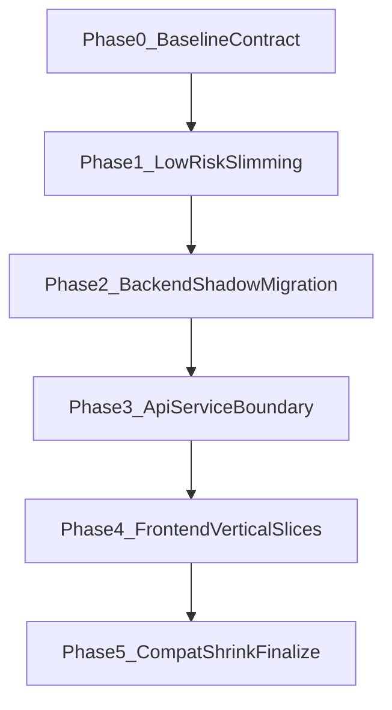

# SuperHermes 全仓库瘦身与工程化重构设计（V2.1）

## 1. 背景与目标

本设计用于在**不改变现有功能与外部契约**的前提下，对 SuperHermes 进行全仓库瘦身与工程化重构。  
核心诉求：

- 保持 API/CLI/评测语义兼容；
- 降低核心模块耦合，缩小单文件复杂度；
- 删除冗余与重复逻辑，减少维护成本；
- 全程可回滚、可验证、可审计。

## 2. 设计原则

1. **兼容优先**：先加兼容层，再迁移实现，最后收缩兼容层。
2. **风险驱动**：先做低风险高收益，再做核心链路拆分。
3. **小步可回归**：每次改动必须通过门禁后再进入下一步。
4. **证据驱动**：以测试、指标和契约比对作为通过依据。
5. **可回滚**：每阶段起点保留快照与验收记录。

## 3. 约束与边界

### 3.1 不可退化约束（Hard Constraints）

- 功能：现有测试必须通过；关键业务路径行为不变。
- 质量：`ruff` 必须通过；`compileall` 必须通过。
- 兼容：API 输入输出字段、CLI 参数行为保持兼容。
- 性能：`File@5`、`Chunk@5`、`MRR` 不下降；P50/P95 不超过预算阈值。

### 3.2 范围

- 后端：`backend/`
- 前端：`frontend/`
- 评测与脚本：`scripts/`
- 测试：`tests/`
- 文档：`docs/`

### 3.3 非目标

- 不做业务功能新增；
- 不做技术栈替换（例如前端框架替换）；
- 不做大爆炸式一次性目录重写。

## 4. 当前状态摘要（执行起点）

当前仓库已有第一轮改造基础（兼容脚手架、部分脚本瘦身、文档基线），并已跑通过一轮全量验证。V2 设计在此基础上继续增量推进，不回退重做。

## 5. 总体方案（V2.1）

### 5.1 分阶段路线

### 5.2 各阶段设计

#### Phase 0：冻结可观测基线与契约

目标：定义“不可退化”并形成可执行验证标准。

动作：

- 固定功能基线（核心测试集 + 通过记录）；
- 固定性能预算（`File@5`、`Chunk@5`、`MRR`、P50/P95）；
- 固定兼容契约（API/CLI 输入输出）；
- 记录 smoke 评测阻塞条件（如 Milvus 状态、索引可用性）。

契约冻结必须产出快照：

- API：OpenAPI JSON 快照 + 关键接口 golden response；
- CLI：`--help` 输出快照 + 典型命令 I/O 快照；
- 评测产物：JSON 字段结构快照；
- 错误路径：错误类型/错误码/用户可见消息快照；
- 配置：默认值与优先级快照。

产物：

- 基线锚点文档；
- 验证命令清单；
- 阻塞项登记与重试条件。

#### Phase 1：高收益低风险瘦身

目标：先清理可再生产物、重复工具逻辑和明显冗余。

动作：

- 清理缓存/日志/调试产物；
- 收敛脚本层重复纯函数；
- 不触碰业务语义与核心执行路径。

变更预算（每批次）：

- 触达文件建议 `<= 8`；
- 净改动行建议 `<= 300`。

#### Phase 2：后端核心影子迁移

目标：拆分 `backend/rag_utils.py` 与 `backend/rag_pipeline.py`，但先不直接切主路径。

动作：

- 提取无状态逻辑（配置读取、规则函数、节点辅助逻辑）到新模块；
- 旧入口保留，对外行为不变；
- 新旧实现双跑比对关键输出（结果集、meta、错误路径）；
- 双跑稳定后再切默认路径。

双跑判等规则（强制）：

1. 文档 ID（`doc_id/chunk_id`）集合必须一致；
2. Top-K 顺序默认一致；同分项允许稳定 tie-break 差异；
3. 分值采用容差比较：`abs(delta) <= 1e-6`；
4. `meta` 按白名单字段比较，不做全量原样比较；
5. 错误路径比较错误类型、错误码、用户可见消息；
6. 排除非确定性字段（如 `timestamp`、`trace_id`）。

关键文件：

- `backend/rag_utils.py`
- `backend/rag_pipeline.py`
- `backend/rag/runtime/config.py`

#### Phase 3：API 与 Service 边界收敛

目标：让 `backend/api.py` 只负责路由与协议层，不直连过多底层细节。

动作：

- 继续按域拆分 router（auth/chat/sessions/documents）；
- service 层承接业务编排；
- 保持原路径、原响应模型兼容。

依赖方向约束（强制）：

- `routers -> services -> domain/runtime`；
- routers 不直接依赖 `rag_pipeline` 内部实现；
- services 不依赖 FastAPI `Request/Response`；
- domain/runtime 不依赖 API 层；
- service 不直接抛 `HTTPException`，由 API 层完成协议映射。

关键文件：

- `backend/api.py`
- `backend/routers/*.py`
- `backend/services/*.py`

#### Phase 4：前端垂直切片拆分

目标：继续缩减 `frontend/script.js` 复杂度，保持 UI 行为一致。

动作：

- 按业务流拆分：`auth_flow`、`chat_flow`、`upload_flow`；
- 原入口保留，逐步切换调用到 `frontend/src/*`；
- 每个切片独立验证，不跨切片大改。

前端门禁（强制）：

- `node --check frontend/script.js`
- `node --check frontend/src/*.js`（按文件逐个执行）
- 关键流程 smoke：登录、会话切换、流式回复、上传。

关键文件：

- `frontend/script.js`
- `frontend/src/api.js`
- `frontend/src/messages.js`
- 后续新增切片模块文件

#### Phase 5：兼容层收缩与最终验收

目标：在引用切换稳定后收缩兼容层，产出最终交付。

动作：

- 引用审计，确认无引用后删除重复实现；
- 更新架构与迁移映射文档；
- 输出删除清单/保留清单/风险清单；
- 执行完整验收并形成结论。

兼容层删除准入条件（全部满足才可删除）：

- 无内部代码引用（`rg` 审计）；
- 无测试直接依赖；
- 文档与迁移映射已更新；
- 至少一个完整阶段稳定通过；
- 删除理由与影响已写入发布说明/迁移说明。

## 6. 验证与门禁

### 6.1 快速门禁（每个小批次后）

- `uv run pytest tests/test_evaluate_rag_matrix.py tests/test_rag_eval_regression.py -q`
- `uv run pytest tests/test_rag_utils.py tests/test_rag_pipeline_fast_path.py -q`

### 6.2 标准门禁（每阶段后）

- `uv run pytest tests -q`
- `uv run ruff check backend scripts tests`
- `uv run python -m compileall backend scripts`

### 6.3 里程碑门禁（环境就绪时）

- `uv run python scripts/evaluate_rag_matrix.py --dataset-profile smoke --variants B0 --skip-reindex --limit 1 --run-id <id>`

### 6.4 引用审计与导入稳定性检查

- `rg "from backend.rag_utils|import rag_utils|rag_pipeline" backend scripts tests`
- `rg "frontend/script.js|window\\.|globalThis" frontend`
- `uv run pytest --import-mode=importlib tests -q`

## 7. 性能与兼容预算

### 7.1 性能预算

- 质量指标：`File@5`、`Chunk@5`、`MRR` 不下降；
- 延迟指标：P50/P95 不超过基线预算（Phase 0 固化）。

### 7.2 兼容预算

- API：字段与状态码语义不变；
- CLI：参数与默认行为不变；
- 评测产物：关键输出结构保持兼容。

### 7.3 变更预算

- 每批次触达文件建议 `<= 8`；
- 每批次净改动行建议 `<= 300`；
- 超预算必须拆分批次，不允许一次性合并大改。

## 8. 回滚设计

### 8.1 回滚粒度

- 以“阶段”为主，“批次”为辅。

### 8.2 回滚触发

- 任一门禁失败；
- 兼容性回归；
- 性能超预算；
- 出现无法在当前批次内修复的结构性问题。

### 8.3 回滚动作

1. 回到阶段起点；
2. 保留失败日志与差异；
3. 缩小改动切片后重试；
4. 必要时降级为只做低风险项。

## 9. 产出物清单

### 9.1 代码产出

- 模块边界更清晰的后端与前端结构；
- 删除冗余逻辑后的精简实现；
- 保持兼容的迁移层。

### 9.2 文档产出

- 基线锚点文档；
- 架构与迁移映射文档；
- 删除/保留清单；
- 风险与后续建议；
- ADR（关键设计决策记录）。

## 10. 阶段验收矩阵

| 阶段 | 必须通过 | 额外验证 | 失败处理 |
| --- | --- | --- | --- |
| Phase 0 | 基线文档、契约快照、性能预算 | smoke 阻塞登记 | 不进入 Phase 1 |
| Phase 1 | 快速门禁、标准门禁 | 删除清单复核 | 回滚当前批次 |
| Phase 2 | 双跑一致性、快速门禁 | 核心 RAG case golden diff | 保留旧路径继续影子 |
| Phase 3 | API 契约 diff、全量测试 | 错误路径回归 | 回滚 router/service 拆分 |
| Phase 4 | 前端门禁、后端快速门禁 | 浏览器手测清单 | 回滚当前切片入口 |
| Phase 5 | 全量门禁、性能评测 | 删除/保留/风险清单 | 保留兼容层不删除 |

## 11. 执行清单（可直接落地）

1. 执行 Phase 0：补齐预算阈值与契约清单；
2. 执行 Phase 1：低风险瘦身，按小批次推进；
3. 执行 Phase 2：后端核心影子迁移与双跑；
4. 执行 Phase 3：API-Service 边界收敛；
5. 执行 Phase 4：前端按业务切片拆分；
6. 执行 Phase 5：兼容层收缩 + 完整验收 + 交付文档。

---

该设计文件为 V2.1 执行依据。若实施中出现新的高风险信号，可在不破坏兼容目标的前提下，优先降低改造切片大小并延后高风险步骤。
