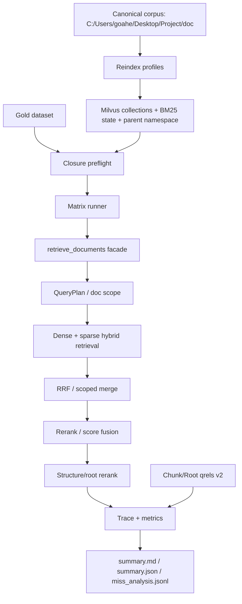

# SuperHermes RAG v3.1 Project Report

Date: 2026-04-26

Historical note: this report predates the short profile naming standard. Names
such as `V3Q`, `GS3`, and `V3F` are retained here only to preserve the original
evaluation record. Current naming is defined solely in
`docs/rag-profile-naming.md`.

## Executive Summary

This pass completed the boundary-governance plan before doing cleanup or evaluation. The system now has a more defensible RAG evaluation base: data closure preflight, canonical Chunk/Root qrels, strict/canonical qrel matching, saved-row regression, backend retrieval/rerank/context/confidence modules, and full qrel-aware performance reports.

The strongest current retrieval result is `V3Q` on quality (`File@5=0.992`, `File+Page@5=0.768`, `Chunk@5=0.724`, `Root@5=0.793`), but it is slower (`P50=3938 ms`). `GS3` remains the best balanced baseline (`File@5=0.920`, `File+Page@5=0.712`, `Chunk@5=0.655`, `P50=1144 ms`). `V3F` is not viable in its current state because file recall collapsed in the latest full run.

## What Was Implemented

### Evaluation Contract

- External qrel input: `--chunk-qrels`.
- Match modes: `strict_id` and `canonical` for chunk/root qrels.
- Conflict policies: `external`, `dataset`, `fail`.
- Coverage gates: `--require-chunk-qrel-coverage`, `--require-root-qrel-coverage`.
- Saved-row summary regression: `--summarize-results-jsonl`, `--regression-baseline-summary`, `--regression-fail-on-diff`.
- Metrics now include `Chunk@5`, `Root@5`, `ChunkMRR`, `RootMRR`, and `AnswerSupport@5_experimental`.

### Backend Boundary Split

`backend/rag_utils.py` remains the compatibility facade, while logic is now separated by responsibility:

- `backend/rag_retrieval.py`: weighted RRF, filename boost, heading lexical scoring, filename filters, dedupe.
- `backend/rag_rerank.py`: pair enrichment, rerank score fusion, provider request execution.
- `backend/rag_context.py`: parent merge and structure/root rerank.
- `backend/rag_confidence.py`: anchor extraction and confidence/fallback decision logic.
- `backend/rag_trace.py`: stable candidate identity and normalized text hash.
- `backend/rag_types.py`: shared trace/error type contracts.

### Qrel Closure

- Generated `rag_chunk_pool_gold_tcf.jsonl` with canonical chunk/root IDs.
- Generated `rag_chunk_gold_v2.jsonl` and review/sample files.
- Current qrel alignment status:
  - 125 total rows.
  - 87 aligned.
  - 12 ambiguous.
  - 26 failed.
  - Chunk/Root qrel coverage: 0.696.
  - Review coverage: 0.000; all labels remain draft/needs_review.

## Current Architecture

## Full Performance Evaluation

Full run: `.jbeval/reports/rag-v3.1-full-gold-qrels-refactor-20260426/summary.md`

Rows: 1000 = 8 variants x 125 gold samples.

| Variant | File@5 | File+Page@5 | Chunk@5 | Root@5 | ChunkMRR | RootMRR | P50 ms | P95 ms | Assessment |
| --- | ---: | ---: | ---: | ---: | ---: | ---: | ---: | ---: | --- |
| GB0 | 0.744 | 0.504 | 0.000 | 0.529 | 0.000 | 0.392 | 939 | 1061 | Baseline is complete but weak at evidence chunks. |
| GS1 | 0.744 | 0.504 | 0.000 | 0.529 | 0.000 | 0.392 | 823 | 1038 | Same quality as GB0. |
| GS2 | 0.872 | 0.680 | 0.000 | 0.644 | 0.000 | 0.508 | 847 | 1058 | Scoped QueryPlan improves file/page/root. |
| GS2H | 0.864 | 0.616 | 0.000 | 0.609 | 0.000 | 0.480 | 836 | 930 | Heading lexical still hurts page localization. |
| GS2HR | 0.992 | 0.752 | 0.000 | 0.770 | 0.000 | 0.645 | 1532 | 2060 | Strong file/page/root, but chunk IDs do not align under this profile. |
| GS3 | 0.920 | 0.712 | 0.655 | 0.724 | 0.580 | 0.637 | 1144 | 1610 | Best balanced deployable baseline. |
| V3Q | 0.992 | 0.768 | 0.724 | 0.793 | 0.575 | 0.635 | 3938 | 4450 | Best quality ceiling, higher latency. |
| V3F | 0.416 | 0.280 | 0.276 | 0.310 | 0.210 | 0.228 | 34 | 3047 | Not production-ready; likely profile/index mismatch. |

Key interpretation:

- Chunk qrels exposed a real evidence gap: TC profiles can hit file/root but show `Chunk@5=0.000` under canonical qrels, while filename-aware/v3 profiles can recover chunk-level evidence.
- `V3Q` is the quality ceiling, but the latency is too high for default interactive use.
- `GS3` is the stable default candidate because it balances file/page/chunk quality and latency.
- `V3F` needs reindex/profile validation before any further analysis.

## all-in-rag Learnings Applied

From the public all-in-rag project and local reference modules:

- Data preparation should preserve parent-child relations, deterministic IDs, and metadata enrichment. SuperHermes now has canonical chunk/root IDs and qrel provenance.
- Retrieval should be hybrid and inspectable. SuperHermes retains Milvus dense+sparse retrieval and RRF, while making strict file candidate recall and stage traces visible.
- Routing should be layered. SuperHermes uses deterministic QueryPlan/doc scope first; LLM router, GraphRAG, HyDE, and query rewrite remain out of scope until qrels are reviewed.
- Evaluation must be part of the architecture. SuperHermes now blocks misleading evaluations with closure preflight and separates File/Page/Chunk/Root denominators.

## What Still Needs Work

1. Human-review the qrels.
   Current qrels are automatic draft labels. Review 30-50 rows first, especially ambiguous/failed rows, before using Chunk@5 as a hard acceptance gate.

2. Investigate profile consistency.
   `V3F` collapsed and `GS2HR` improved sharply relative to earlier reports. Run profile-specific golden traces and reindex validation before trusting those changes as algorithmic.

3. Finish evaluation modularization.
   Metrics and regression are split, but preflight/reporting/runner are still too much in `evaluate_rag_matrix.py`. Move them only under saved-row regression.

4. Add page-aware evidence ranking.
   The next quality lift is likely not a bigger reranker; it is a file -> page -> chunk localization chain.

5. Add selective fallback.
   Recommended future online route: `GS3 default`, `V3Q fallback only for low-confidence queries`.

## Next Execution Plan

| Priority | Task | Purpose | Acceptance |
| --- | --- | --- | --- |
| P0 | Review 50 qrel rows | Make Chunk/Root metrics trustworthy | At least 40 approved or corrected qrels |
| P0 | Rebuild and verify `v3_fast` | Resolve V3F collapse | Coverage 60/60 and FileCandRecall near GS3 |
| P1 | Golden trace regression for GS3/V3Q/GS2HR | Separate real gains from profile drift | Candidate/rerank/final signatures explained |
| P1 | Extract preflight/reporting/runner modules | Complete evaluation governance | Saved-row summary remains identical |
| P1 | Add page-rank before/after rerank metrics | Diagnose page localization | Report includes page candidate recall/drop |
| P2 | Page-aware fusion ablation | Improve File+Page/Chunk@5 | Compare GS3 vs GS3+page fusion |
| P2 | GS3 + V3Q fallback experiment | Improve quality without full V3Q latency | Report quality, fallback rate, blended P50/P95 |

## Verification

- `uv run pytest tests`: 220 passed, 1 warning.
- `uv run ruff check backend scripts tests`: passed.
- `git diff --check`: passed.
- `uv run python -m compileall backend scripts`: passed.
- Full qrel evaluation completed: 1000 rows, error rate 0.000 for all variants.
